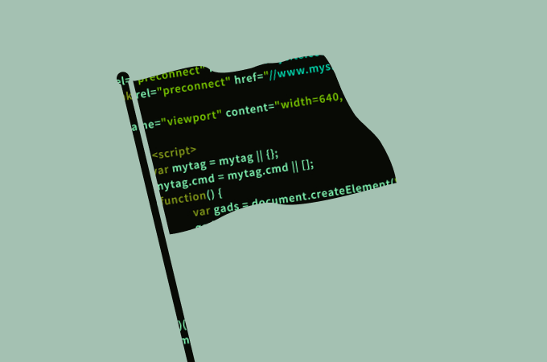

# CTF Writeups

This repository contains my CTF and cybersecurity lab writeups.

## Categories

- Web Exploitation
- Reverse Engineering
- Linux Privilege Escalation
- Windows / Active Directory
- Forensics
- Miscellaneous

## Writeups

| Event / Platform | Category | Link |
|---|---|---|
| CAPTUREX CTF | Boot2Root / Web / Linux | [View](./CAPTUREX-CTF/) |
| iGoH 2025 AntiFlag | Mixed CTF | [View](./IGOH25/) |
| NEXSEC 2025 BATERIAAA | Reverse Engineering, Malware Analysis, Incident Response, Digital Forensics, Memory Forensics | [View](./NEXSEC-2025/) |
| HACKNYX CTF | WEB, BOOT2ROOT, OSINT, FORENSICS | [View](./HACKNYX-CTF/) |
| LIGA CTF | Reverse Engineering, Boot2Root, Forensics, Osint, Web, Labyrinth, APT | [View](./LIGA2026/) |
| UITM-INTERNAL-CTF | Reverse Engineering, Pwn, Forensics, Osint, Web, MISC, Crypto | [View](./UITM-INTERNAL-CTF/) |
